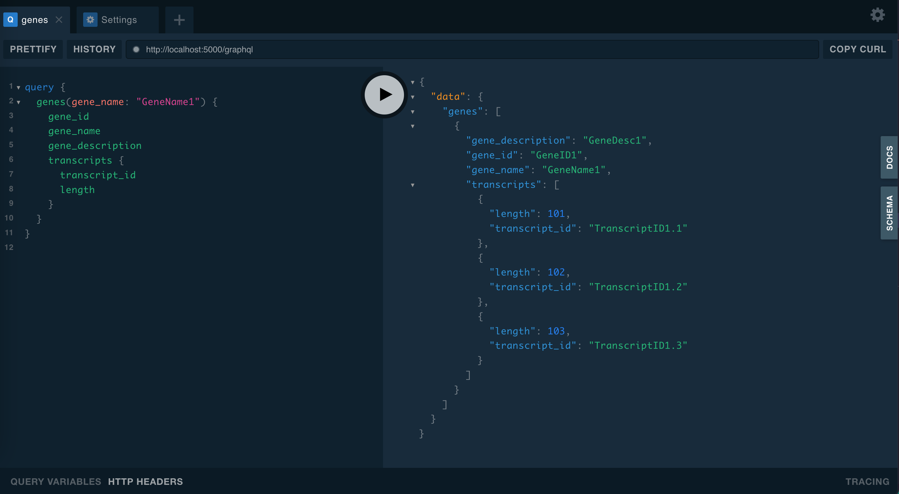

# 🧪 Basic GraphQL API for a Bioinformatics Case

[](https://github.com/furkanmtorun/GraphQL_API_in_Bioinformatics/actions/workflows/api_test.yml)


## 💡 TL;DR: What is this at all?
Here is a basic GraphQL API built for a bioinformatics (genomics) case by empowering Python & Flask (web microframework) and Ariadne (for GraphQL API) together with the explanatory documentation!

⭐ If you like it, please do not forget to give a star!


*An example query for fetching a specific gene and its all transcript-related info*

<details>
<summary>Are you looking for an daily life analogy instead of `gene`, `transcript`, `expression_profiles` terms?</summary>
You could think of an <b>author</b> instead of a <b>gene</b>. So, our authors (genes) might have more than one <b>book (transcript)</b>. Also, each <b>book (transcript)</b> could have more than one version/type and - so, their meta information also change!
</details>

---

## 💭 What is GraphQL and was I aiming for with this side project?

Together with the advancements in the disparate areas of bioinformatics/computational biology, the need for accessing the data lakes/warehouses increased! Yet, it is challanged to make those data resources accessible to the community.

> Definition of GraphQL by [GraphQL (graphql.org)](https://graphql.org/)
> 
> GraphQL is a query language for APIs and a runtime for fulfilling those queries with your existing data.

GraphQL, created by Facebook, is designed to provide a better web API standard by building fast, flexible and also developer-friendly APIs.

However, the vast majority of bioinformatics resources use REST (representational state transfer) APIs and use of GraphQL in bioinformatics is still limited even though it comes with several advantages! 

Hopefully this basic example makes the transition to GraphQL easier than ever thought!

**Available GraphQL Libraries in Python:**

- [Graphene](https://graphene-python.org/)
- [**Ariadne <- That's what I empower here!**](https://ariadnegraphql.org/)
- [Strawberry](https://strawberry.rocks/)
- [Tartiflette](https://tartiflette.io/)

> To see the difference, check out: [https://morioh.com/p/f9d3c644b20b](https://morioh.com/p/f9d3c644b20b).

<br>

## 💎 Why should you prefer empowering GraphQL over REST?

REST vs GraphQL?  As always, the answer is "okay, depends on your task/project!". 
Here are the reasons you should prefer using GraphQL. 

In this repo, a bioinformatics case met all these criteria! *(For sure, this could be generalized to other domains as well!)*

- **Reason 1: Endpoints & Versioning**
  - To build the same example here with REST, you should have at least 3 endpoints: `/gene`, `/transcript`, `/expression_profiles`. For now, it could be easy to maintain and version the API (**by keeping the conventions as the API evolves over time**) however most of the time the number is so larger than 3! Here, you have only one endpoint, `/graphql` and there is no need to worry about versions and URL changes!

- **Reason 2: Nested queries**
  - You can find yourself querying several endpoints for several different resources/topics. Here, in this example, to have the expression profiles of each of transcripts for all genes [(check the `Data Schema` section to see the relation)](#🎯-data-schema-and-query-examples), we need to have nested queries! In REST arch., you need to make at least 3 request and create a loop. However, with GraphQL, you can fetch all of them (according to your needs) within a single query! Yes, this is pretty cool! 

- **Reason 3: Saving bandwidth (A bit tricky)**
  - In RESTful API, most of the time, it brings over-fetching issue (excessive data is fetched at once) when you send a request even though some of them are not needed! Other way around, under-fetching could be a case as well! However, by specifiying the fields you need within the GraphQL queries, you can reduce the amount of data transmitted and improve the overall performance!
  
  > Note: The tricky part is the following: If the clients send a query asking all of the fields, it will end up with performance issues :)

- For more details on the reasons to use and NOT to use, please have a look [this post](https://www.apollographql.com/blog/graphql/basics/why-use-graphql/) and [this post](https://blog.logrocket.com/why-you-shouldnt-use-graphql/), respectively!

<br>

## 🧵 Installation and Running

- **Installation:**

  - Clone the repository:
    - `git clone https://github.com/furkanmtorun/GraphQL_API_in_Bioinformatics`

  - Navigate into the directory:
    - `cd GraphQL_API_in_Bioinformatics`
  
  -  Install the requirements in your environment (recommended):
     -  `pip install -r requirements.txt`

- **Running**:

    > Note: I already enabled the Flask app to run in debug mode in `main.py`, so no need to set environment variable for the file name, meaning that you directly run it!

  - Run the app: `python main.py`
  - Visit the GraphQL API on [`http://127.0.0.1:5000/graphql`](http://127.0.0.1:5000/graphql)

<br>

## 🎯 Data Schema and Query Examples

- Check [`schema.graphql`](./schema.graphql) file out to see the schema to be used by GraphQL API 
  
  > Note: you could also see this on the web UI by toggling the `Schema` button at the right side of the page!

- Here, I provided some queries to demonstrate the use of GraphQL API. For detailed explanations and examples, navigate to [`Example_Queries.md`](./Example_Queries.md) page!

  > Feel free to play around with them to learn more!

- As it would be out of scope for this repo and to make this API Example simpler, I avoid to integrate any type of DB connection, rather directly store them in `data_fetch.py`.

<br>

## 🗂 File/Code Organization

Find the explanation below for each file in this repo to make it everything crystal clear!

```
.
├── Example_Queries.md  <- Explains the syntax and lists some example queries
├── README.md           <- You are here!
├── api
│   ├── __init__.py     <- Defines Flask app and set DB link
│   ├── data_fetch.py   <- Stores data (but should be DB connection/querying functions in ideal case)
│   └── resolvers.py    <- Defines resolvers for the fields
├── requirements.txt    <- Environment needs to install
├── main.py             <- Defines GraphQL endpoints and relate the resolvers into fields 
└── schema.graphql      <- Data schema to be read & used by GraphQL
```

<br>

## 🎈 What could be added to improve?
- [ ] Mutations, (see [here](https://graphql.org/learn/queries/) for more details)
- [ ] DB Connection for data fetching rather than storing them directly in `data_fetch.py` (I did so for simplicitiy)

<br>

## 🚀 Author and Developer
- Furkan M. Torun
- Twitter: [@furkanmtorun](https://www.twitter.com/furkanmtorun)
- Mail: [furkanmtorun[at]gmail[dot]com](mailto:furkanmtorun@gmail.com) 
- Academia: [Google Scholar Profile](https://scholar.google.com/citations?user=d5ZyOZ4AAAAJ) 
- Website: [furkanmtorun.github.io](https://furkanmtorun.github.io)

Moreover, please do not hesitate to comment via opening an issue via GitHub if you have any suggestions or feedback!

<br>

## ℹ️ References & Resources

- Explanatory Video: [https://www.youtube.com/watch?v=7ccdWqGgHaM](https://www.youtube.com/watch?v=7ccdWqGgHaM)
- Sam M Ireland, Andrew C R Martin, GraphQL for the delivery of bioinformatics web APIs and application to ZincBind, Bioinformatics Advances, Volume 1, Issue 1, 2021, vbab023, https://doi.org/10.1093/bioadv/vbab023
- Schema Definitions: https://www.apollographql.com/docs/apollo-server/schema/schema/
- https://blog.logrocket.com/build-graphql-api-python-flask-ariadne/
- https://www.apollographql.com/blog/graphql/python/complete-api-guide/
- https://www.twilio.com/blog/graphql-api-python-flask-ariadne
